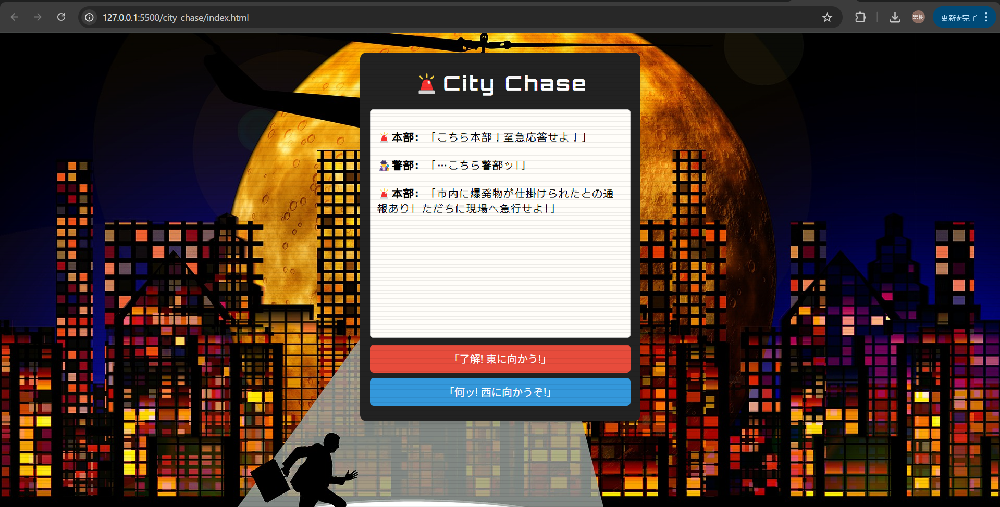
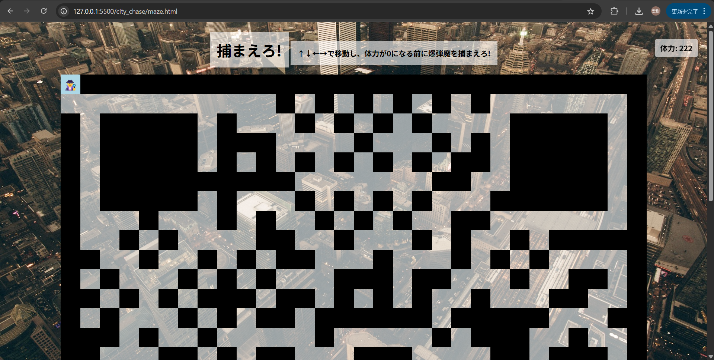

# City Chase - チャット風×迷路アドベンチャー（JavaScript）

街を舞台に、チャット形式で犯人を追い詰めろ！  
選択肢で展開が変わる「シティーチェイス」× 迷路探索の  
**ブラウザで遊べる JavaScript ゲーム**です。

---

##  公開URL（GitHub Pages）

[https://muratter93.github.io/city_chase/](https://muratter93.github.io/city_chase/)

---

## 遊び方

1. `index.html` を Live Server またはブラウザで開く
2. チャット風の選択肢を進めながらストーリーが展開
3. `maze.html` に進むと迷路パートに突入！

---

## 構成ファイル

| ファイル          | 役割                        |
|------------------|-----------------------------|
| `index.html`     | スタート画面・チャットUI      |
| `main.js`        | チャット制御ロジック          |
| `chat.json`      | 会話データ                   |
| `maze.html`      | 迷路パート（ゲーム画面）      |
| `maze.js`        | 迷路のロジック               |
| `maze.css`       | 迷路の見た目スタイル          |
| `画像ファイル群`  | 背景やマップのビジュアル      |

---

##  画面イメージ

---

## ⚙技術スタック

- HTML / CSS / JavaScript（Vanilla JS）
- Live Server推奨（VS Code拡張）
- GitHub Pagesで公開

---

## 作者

- GitHub：[@muratter93](https://github.com/muratter93)

---

## ライセンス

MIT License
